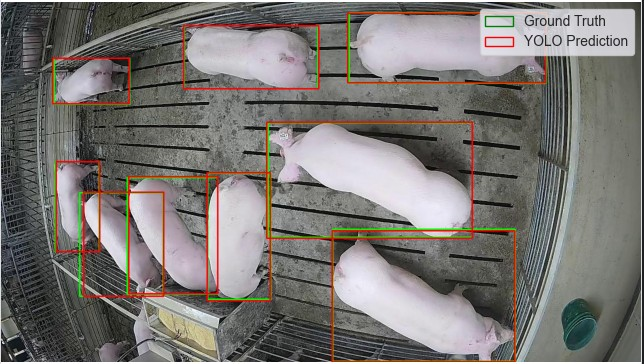
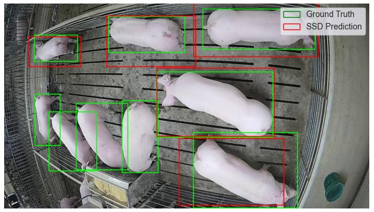
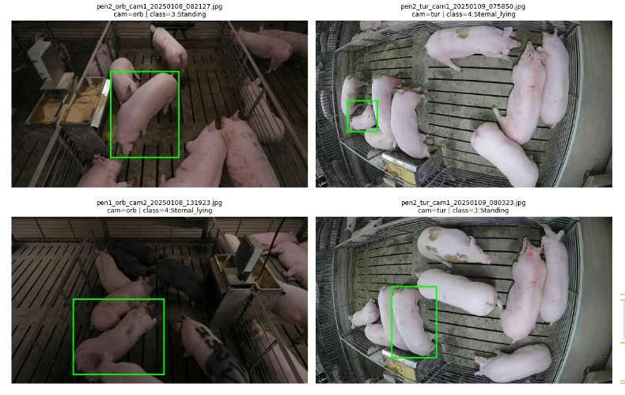
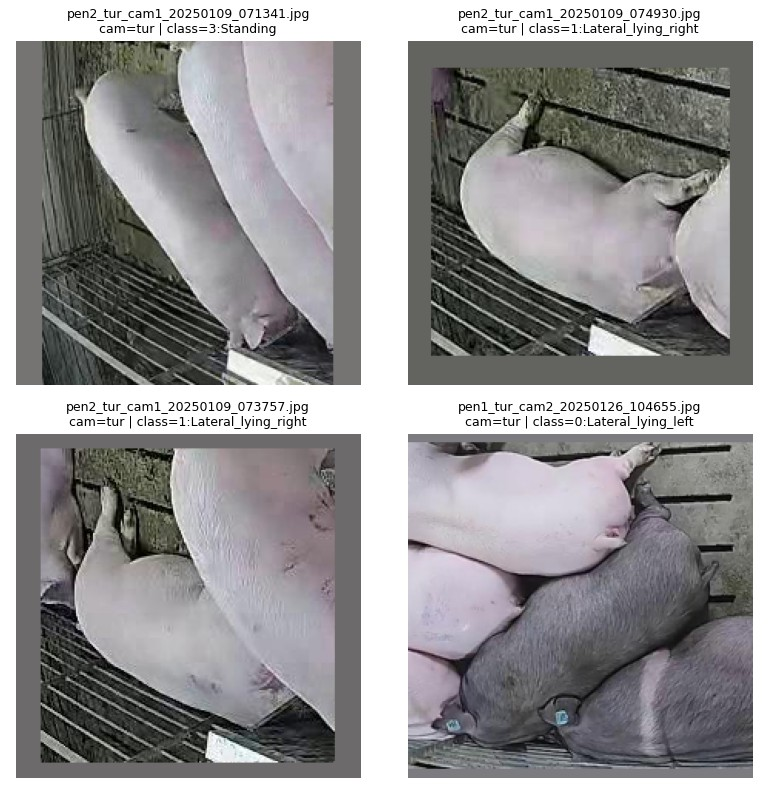
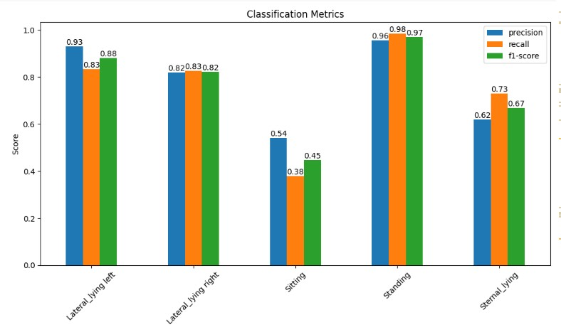
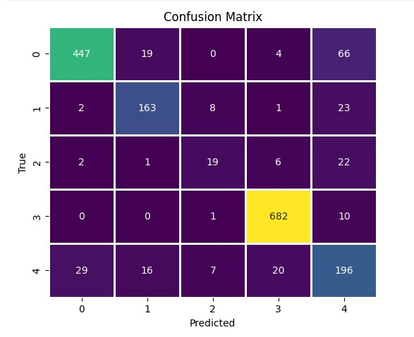
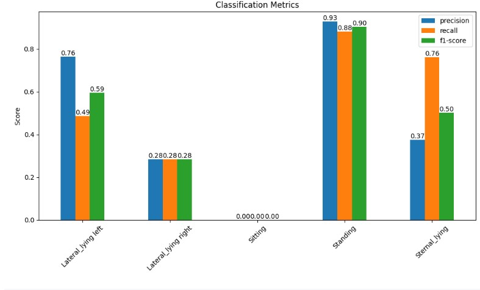
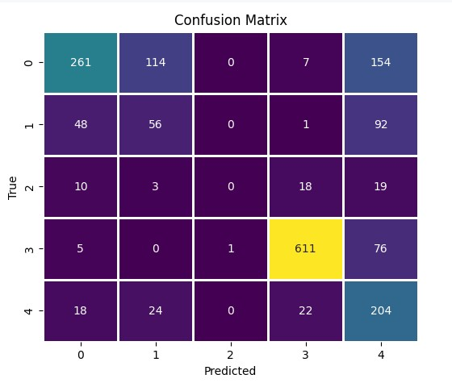

# kaggle_Multiview_Pig_Posture_Recognition

I ranked **28th** in the [Kaggle Multi-view Pig Posture Recognition competition](https://www.kaggle.com/competitions/multi-view-pig-posture-recognition)！

## Introduction

The goal of the competition is to develop computer vision models that can automatically recognize the posture of pigs from multi-view images in a farm environment. Each image contains annotated bounding boxes around pigs, and the task is to classify the posture of each pig into one of several categories such as standing, sitting, or lying.

Pig posture recognition plays an important role in precision livestock farming. Changes in posture and activity can reflect the health, welfare, and behavior of animals. In this project, we explore deep learning–based approaches for pig detection and posture classification, evaluate model performance on the competition dataset, and analyze the robustness of the models across different camera views and environments.

## Dataset

This project uses the dataset provided in the Kaggle competition  
[Multi-view Pig Posture Recognition](https://www.kaggle.com/competitions/multi-view-pig-posture-recognition/data).  
We use the **train2** subset released by the competition as the primary training source.

Each image contains bounding box annotations for pigs along with a posture label.  
The task is to detect pigs and classify their posture into one of the following categories:

| Class ID | Posture Name |
|---------|--------------|
| 0 | Lateral_lying_left |
| 1 | Lateral_lying_right |
| 2 | Sitting |
| 3 | Standing |
| 4 | Sternal_lying |

To prevent **data leakage**, images captured in the same scene and time window are grouped together.  
Since multiple frames may be captured from the same camera within a short time interval, we apply a **45-second temporal threshold** to prevent data leakage between the training and validation sets.
In addition, all images captured on **Feb 9th, 2025** are used as the test set to simulate a real deployment scenario. The model has never seen data from that day during training.

After grouping and splitting the dataset, the final dataset sizes are:

- **Train:** (16,678)  
- **Validation:** (4,512)  
- **Test:** (1,744)

## Exploratory Data Analysis

To better understand the dataset, we first examine the class distribution and camera-view distribution across the dataset.

### Class Distribution

The distribution of posture classes is highly imbalanced. Certain postures such as Standing appear significantly more frequently than others. This imbalance reflects real-world farm environments, where pigs spend different amounts of time in different postures.

### Camera View Distribution

The dataset is collected from multiple camera angles, and the distribution of camera views is also not uniform. Some cameras contribute a much larger number of images than others.

To better simulate a real-world deployment scenario, the validation set is constructed to mimic the camera-view distribution and posture distribution observed in real farm data. By aligning the validation distribution with realistic conditions, we aim to obtain a more reliable estimate of model performance when deployed in practice.

## Problem 1: Bounding Box Regression (preliminary study)

To validate the quality of the provided bounding boxes, we train object detectors to re-predict the bounding boxes and compare them against the ground-truth annotations. We experiment with two models: `YOLOv8` and `SSD300 (VGG16 backbone)`.

**Optimizers**
- **SSD300**: AdamW (lr = 0.001111, weight_decay = 0.0005)
- **YOLOv8**: AdamW (lr = 0.001111, momentum = 0.9)

Below are typical prediction examples:

Qualitatively, YOLOv8 produces tighter and more accurate boxes, while SSD often fails to localize the pigs correctly. This is also reflected in the quantitative metric: we compute the mean IoU over all images, where **YOLOv8 achieves 0.87**, while **SSD300 achieves 0.079**.

## Problem 2： Posture Classification

We train two image classification backbones for pig posture recognition: `facebook/convnextv2-tiny-22k-224` and `google/vit-base-patch16-224`. We adpt several strategies including:

**Preprocessing & Augmentation.** Each pig is cropped using the provided bounding boxes, resized to 224×224, and augmented with `RandAugment(num_ops=2, magnitude=7)` to improve robustness to lighting, viewpoint, and background variations.

**Training Strategy.** We adopt common fine-tuning practices, including a **freeze-then-unfreeze schedule** and **learning-rate decay**, to stabilize optimization and improve generalization.

More implementation details and hyperparameters can be found in:
- `vipig.ipynb`
- `covpig.ipynb`

### Input Visualization

**Original images (with bounding boxes).**  
Note that a single image may correspond to multiple rows in the dataset because multiple pigs can appear in the same photo.

**Model input.**  
Each pig is cropped using the corresponding bounding box and resized before being fed into the model.

## Conclusion

We compare the performance of **ConvNeXtV2** and **Vision Transformer** for pig posture classification.

### ConvNeXtV2 Results

### Vision Transformer Results

From the results, ConvNeXtV2 performs noticeably better than ViT. In particular, ConvNeXtV2 is able to correctly identify the **Sitting** posture, while ViT struggles to capture this class and tends to misclassify it as other postures.

## Author
Kaixuan Chen  
Northwestern University  
M.S. in Machine Learning and Data Science
